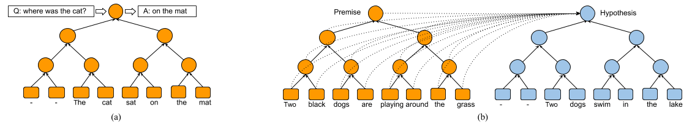

Neural Tree Indexers
=================================

Chainer implementation of [Neural Tree Indexers for Text Understanding](https://arxiv.org/abs/1607.04492).

This implementation contains:

1. Full tree matching NTI-SLSTM-LSTM
    - Combines both recurrent sequential and recursive tree models
    - Performs tree matching with standart LSTM units
2. Fast global and tree attentions described in the paper

Prerequisites
-------------

- Python 2.7
- [chainer](http://chainer.org/) (tested on chainer 1.7.1 and 1.12.0)
- Other data utils: sklearn, pandas, numpy etc.

Usage
-----

To train a model with SNLI dataset:

    $ python train_snli.py --snli path/to/snli_1.0 --glove path/to/glove.840B.300d.txt

Results
-------

Full tree matching NTI-SLSTM-LSTM model with global attention achieves around 87.3% accuracy on Stanford NLI dataset.

Author
------

Tsendsuren Munkhdalai / [@tsendeemts](http://www.tsendeemts.com/)